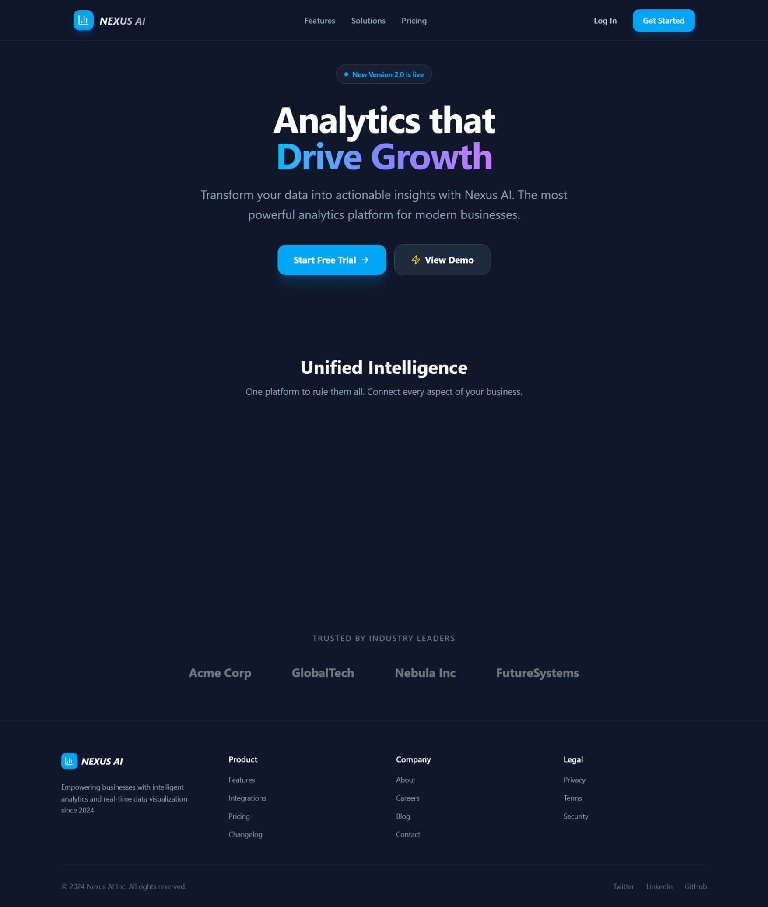
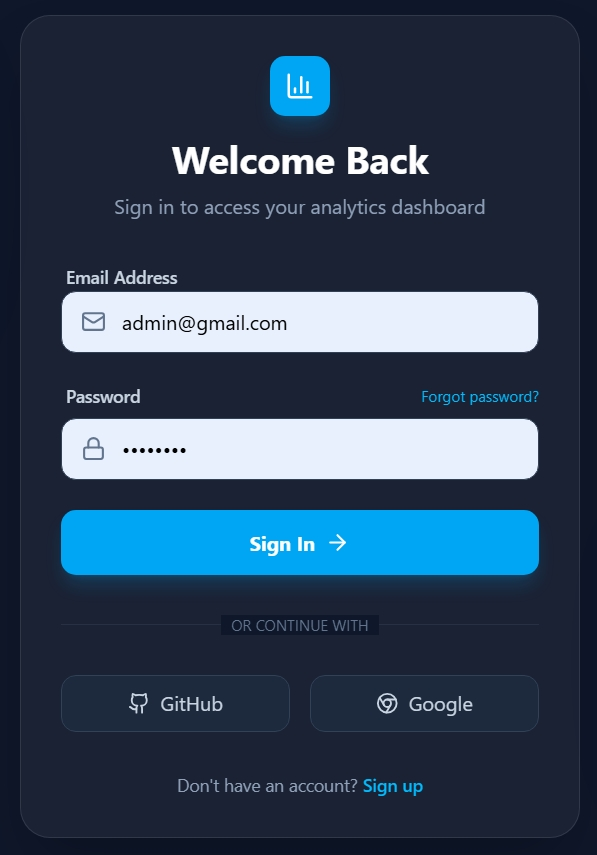
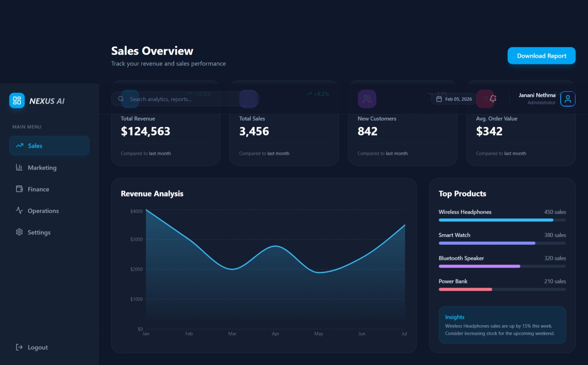
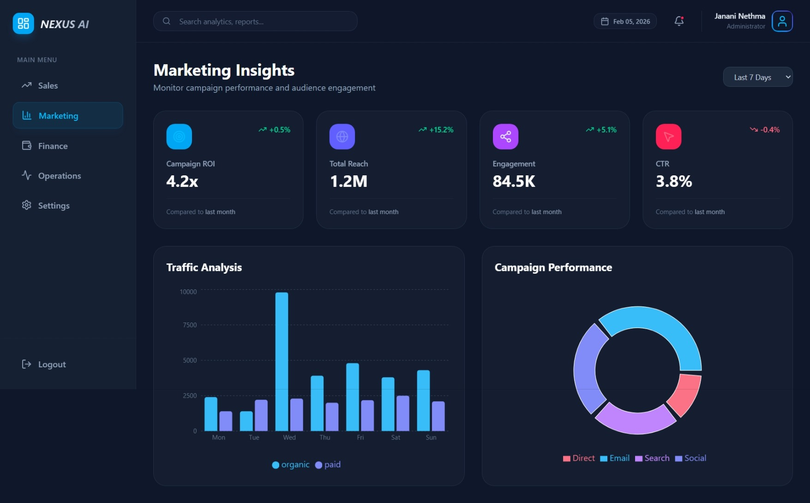
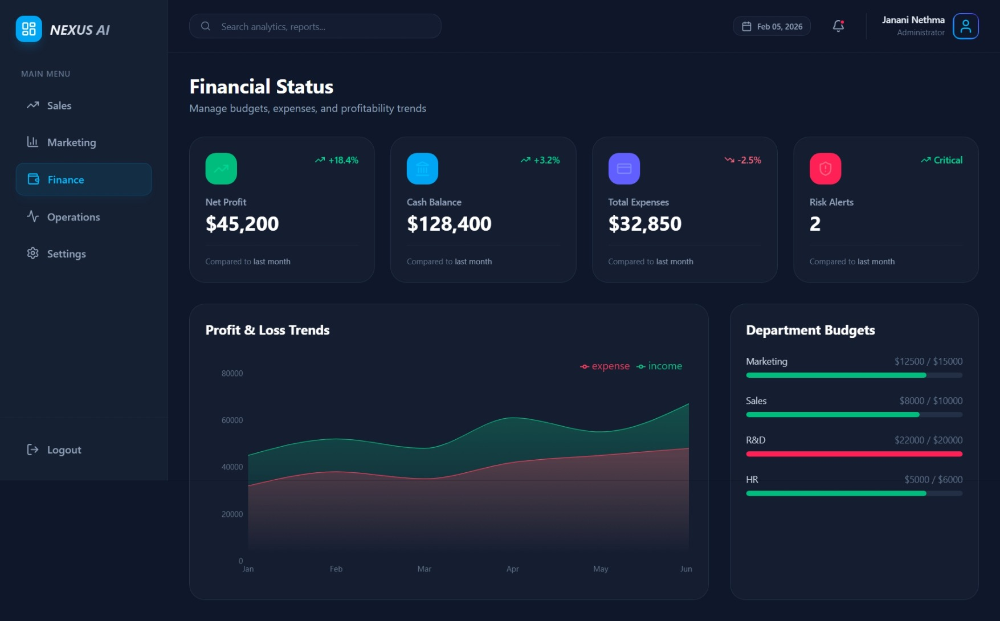
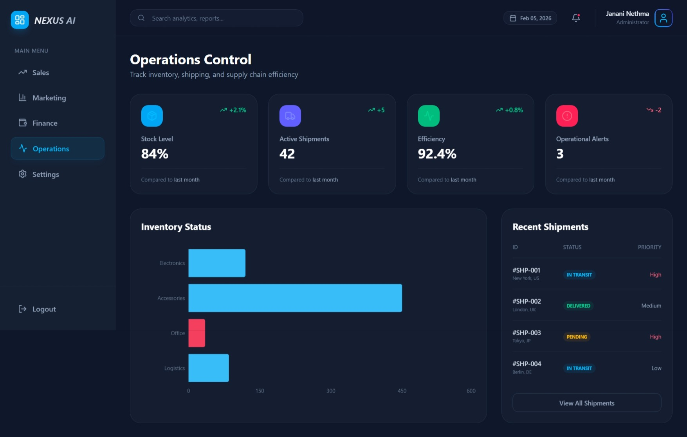

# Nexus AI - Analytics Dashboard

A modern, high-performance analytics dashboard built with React, Vite, and Tailwind CSS. This application provides comprehensive insights into Sales, Marketing, Finance, and Operations with a sleek, responsive design.

## 🚀 Features

- **Multi-Dashboard Architecture**: Dedicated views for Sales, Marketing, Finance, and Operations.
- **Interactive Visualizations**: Beautiful charts and graphs powered by Recharts.
- **Modern UI/UX**: Glassmorphism effects, smooth animations (Framer Motion), and a fully responsive layout.
- **Authentication Flow**: Login and Signup pages with validation states.
- **Settings Management**: Configurable user profile, notifications, and security settings.

## 🛠️ Tech Stack

- **Frontend**: React 19, React Router Dom
- **Styling**: Tailwind CSS, Lucide React (Icons)
- **Visualization**: Recharts
- **Animations**: Framer Motion
- **Build Tool**: Vite

## 📸 Screenshots

### Landing Page


### Login Screen


### Sales Dashboard


### Marketing Analytics


### Finance Overview


### Operations Control


## 📦 Installation & Setup

1. **Clone the repository**
   ```bash
   git clone <repository-url>
   cd analytics_dashboard
   ```

2. **Install dependencies**
   ```bash
   npm install
   ```

3. **Run development server**
   ```bash
   npm run dev
   ```

4. **Build for production**
   ```bash
   npm run build
   ```

---
© 2024 Nexus AI. All rights reserved.
